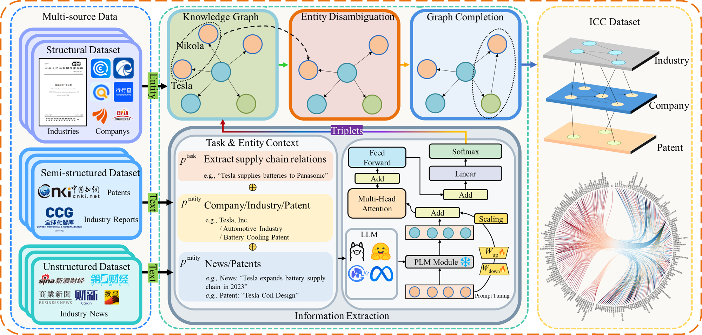

# ICKG: Industrial Chain Knowledge Graph Dataset

**ICKG** is an open-source dataset focused on constructing a temporally-resolved **Industrial Chain Knowledge Graph**. Designed to support research on industrial dependencies, supply–demand relationships, and dynamic risk forecasting, ICKG provides a comprehensive, temporally-aware representation of industrial chain structures and their evolution.

This repository includes three datasets:
- **ICKG**: The full dataset.
- **ICKG-subset**: A smaller subset for quick experimentation.
- **ICKG-25**: An extended subset containing data up to **September 2, 2025**.

---

## Background

While general-purpose knowledge graphs are abundant, domain-specific ones remain rare, particularly in the industrial and supply chain sectors. Progress in this field has often been impeded by the lack of publicly available heterogeneous datasets that capture the complexity of cross-industry dependencies.

**ICKG** fills this gap by offering a resource that integrates heterogeneous sources such as **news, patents, industry reports, and statistical yearbooks**, spanning from **2015-01-01 to 2025-09-02**. Through processes of entity extraction, disambiguation, and relation alignment, ICKG delivers a structured foundation for academic research and real-world applications.

---

## Dataset Overview & Statistics

The dataset captures **entities** (industries, companies, patents), **relations** (e.g., upstream, supply, inclusion), and **temporal annotations** across a ten-year period.

### Construction Workflow
The overall construction workflow—from multi-source data collection to ontology construction and graph completion—is illustrated below.

### Data Evolution and Composition
To ensure robust temporal reasoning, ICKG aggregates data from diverse authoritative media outlets. The figure below illustrates the **temporal evolution of news volume** and the **normalized relative composition** of media sources over time. This highlights the dataset's scale, temporal continuity, and the heterogeneous nature of the source material.

---

## Methodology: Dual-Prompt Extraction

Constructing a reliable Knowledge Graph from industrial texts poses unique challenges due to high noise levels and complex, evolving terminology. To address this, we developed a **Dual-Prompt Learning Framework** that synergizes **Soft Prompts** (for latent domain adaptation) and **Hard Prompts** (for explicit schema enforcement).

### Comparative Extraction Quality
As demonstrated in the comparison below, our method achieves higher fidelity to expert annotations compared to classic baselines. The framework effectively:
1.  **Filters Noise:** Ignores non-factual sentiment (e.g., "admiration") to focus on core industrial relations.
2.  **Enforces Schema:** Captures complex multi-party relations and avoids hallucinated relation types.

---

## Performance & Validation

We conducted rigorous ablation studies to validate the contribution of each component in our extraction pipeline.

### Ablation Study
The figure below compares the performance of **Soft Prompt Only**, **Hard Prompt Only**, and our **Dual Prompt** method. The results confirm that combining latent semantic adaptation with structural constraints yields superior Precision, Recall, and F1-scores, ensuring the construction of an ontology-consistent Knowledge Graph.

---

## Dataset Structure

The dataset follows standard Temporal Knowledge Graph (TKG) conventions:
- **TKG with event quadruples**: `(head, relation, tail, time)`
- **Timestamps**: Specific timestamps corresponding to real-world dates.
- **Splits**: Training, validation, and test splits organized chronologically to prevent data leakage.

### Data Format

**ICKG** is the default folder containing the graph dataset and splits:

* `train.txt`, `valid.txt`, `test.txt`: The first four columns correspond to **head entity ID, relation ID, tail entity ID, and time ID**.
* `stat.txt`: Contains the **number of entities, number of relations, and number of timestamps**.
* `entity2id.txt`: Maps entity names to IDs.
* `relation2id.txt`: Maps relation names to IDs.
* `time2id.txt`: Maps time IDs to real-world dates.

**ICKG-subset**: A smaller representative dataset adopting the same format as `/ICKG`, designed for lightweight testing and experimentation.

---

## Usage

The dataset is designed for temporal knowledge graph methods and graph-based AI research, enabling applications such as:

- **Temporal Link Prediction**
- **Industrial Chain Dependency Modeling**
- **Supply Chain Risk Forecasting**
- **Entity and Relation Evolution Analysis**

ICKG is freely available for academic and research purposes. This dataset will continue to be updated and improved to support the community.
